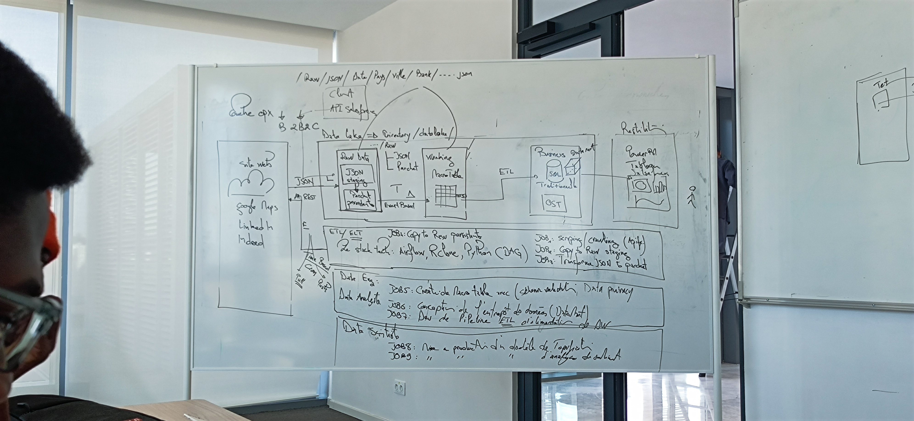

# BRI
BankReviewIntelligence :  Insightful analytics and decision-making support based on customer reviews of banks.



## Getting started
This repository offers a Dockerfile accompanied by a Docker Compose YAML file. These resources are provided for those who wish to host Airflow on their local computer or a standalone machine.

## Project Structure

- `src/`: Contains the source code for the project.
-`data/`: Contains the scraped data in CSV format.
- `requirements.txt`: Lists the Python dependencies.
-`README.md`: Project documentation.

## Version of Airflow and Python we're using
* python>=3.8
* airflow==2.9.0

### Build docker image
Two ways to build this project:
* Build from Dockerfile in the repository
    1. cd to AirflowService
    ```
    cd AirflowService
    ```
    2. build
    ```shell
    docker build -t um6p_bri_airflow .
    ```

### Start the Airflow Services
* Build docker network for the network between Airflow services
    ```shell
    docker network create airflow_network
    ```
* Utilize the Dockerfile in the repository to build and initiate the service.
    #### Use Built image
    or
    #### execute docker compose command
    ```shell
    docker-compose up -d --build
    # Run the container in the background
    ```
    This command will start the Airflow services, building the necessary components as specified in the provided Dockerfile. The -d flag ensures the container runs in the background for seamless execution.

### OTHER
* Connect to database:
    1. psql -h localhost -p 5433 -U airflow_user -d airflow_db
